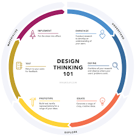

# Proyecto Save the Children| Track UX _Laboratoria_

## Reto

Optimizar la conversión de visitantes a donadores, mediante landing page www.apoyo.savethechildren.mx

********************************************************************************

## Design Thinking:

 
 

********************************************************************************

### Planeación:

Integrante| Puesto |
--- | --- | 
*Dan Serrano* | Product Owner |
*Abril* | Designer|
*Rosa Talia* | Researcher |
*Samahara* | Designer |
*Itzel* | Researcher |
*Scarlett* | Designer |

********************************************************************************

## < l a b o r a t o r i a >
